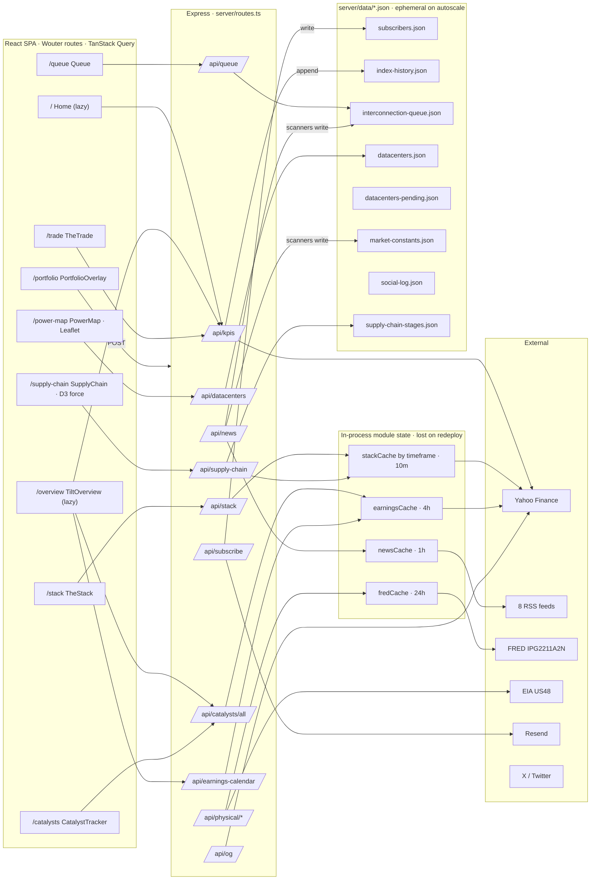

# GridTilt — Architecture

> Generated during the Phase 0 audit (2026-06-09). Reflects `main` @ `dbbf7ac`, verified against a live read of the code and a running local instance. This is the map; problems found while drawing it live in `docs/audit/01_findings.md`.

## What it is

A single Node/Express process that serves both a React SPA and a JSON API on one port (5000). No database: all persistence is JSON files under `server/data/` read and written with `fs` from inside `server/routes.ts`. External data comes from Yahoo Finance (unofficial), 8 RSS feeds, FRED, and EIA. Email goes through Resend; social posts through the X v2 API with hand-rolled OAuth 1.0a. Deployed on Replit autoscale, where the filesystem is ephemeral across deploys and scale events.

```
Browser ──HTTP──> Express (one process, port 5000)
                    ├── /api/*        JSON API  (server/routes.ts, ~60 endpoints)
                    ├── /sitemap.xml, /feed.xml, /robots.txt, /api/og, ...  (SEO)
                    └── /*            SPA  (prod: dist/public + SEO meta injection;
                                            dev: Vite middleware)
```

## Request → data flow



## Persistence — what is written at runtime (the autoscale risk surface)

Every file below is a non-atomic read-modify-`writeFileSync` with no locking. On Replit autoscale the deployed image contains only the git-committed seed; every runtime write lands on instance-local disk and is lost on the next deploy or scale event. Multiple instances fork state.

| File | Written by | Lost-on-redeploy impact |
|---|---|---|
| `subscribers.json` | `/api/subscribe`, `/api/unsubscribe`, admin delete (`routes.ts:1945`) | **Critical** — only durable copy is Resend, and only if `RESEND_API_KEY` is set. Not in git. |
| `interconnection-queue.json` | admin backlog routes + news scanners (`routes.ts:850,3098`) | High — admin edits + auto-updates revert to the May 20 seed |
| `datacenters.json` | admin CRUD + ingester approve (`routes.ts:2592`) | High — added/approved sites revert |
| `datacenters-pending.json` | ingester (`datacenter-ingester.ts:293`) | High — pending queue + reject state revert |
| `index-history.json` | `/api/kpis` daily append (`index-history.ts:102`) | Medium — regenerable via `npm run backtest:indices` |
| `market-constants.json` | uranium news scanner (`routes.ts:382`) | Medium — self-heals on next news match |
| `social-log.json` | tweet cron + manual posts (`routes.ts:1440`) | Medium — audit trail only |
| `backlog-auto-updates.json` | backlog scanner (`routes.ts:744`) | Low — audit trail only; never in git |

## Module inventory

**Server (`server/`, ~5.9K LOC).** `routes.ts` (3,485 lines — the god-file: ~60 endpoints, inline `COMPANY_DATABASE` + `STATIC_MARKET_DATA` datasets, HMAC unsubscribe, RSS fetch, news→file scanners, X OAuth client, OG image route, tweet composers, admin CRUD). Cleanly factored modules: `indices.ts` (pure index math, unit-tested), `physical.ts` (FRED/EIA), `index-history.ts` (daily series append), `datacenter-ingester.ts` (RSS auto-discovery + approve/reject queue), `social-format.ts` (tweet copy formatters, unit-tested), `seo.ts` (per-route meta injection), `static.ts`/`vite.ts` (SPA serving), `index.ts` (boot, helmet, rate limits, logging, error handler).

**Client (`client/src/`, ~12.5K LOC).** Wouter routes in `App.tsx`. Pages: TiltOverview (1,369), PowerMap (1,264, Leaflet + CartoDB), SupplyChain (926, D3 force graph from `data/supply-chain-config.ts`), TheTrade (713), TheStack (618), CatalystTracker (536), Queue (411), plus programmatic stock/sector/region/operator/blog pages and two admin consoles. TanStack Query defaults: `staleTime: Infinity`, `retry: false`, `refetchOnWindowFocus: false` (`lib/queryClient.ts`).

**Build.** `script/build.ts`: Vite builds the client to `dist/public`; esbuild bundles `server/index.ts` → `dist/index.cjs` (CJS, minified, most deps left external). Production reads `server/data/`, `server/fonts/`, and `content/blog/` from `process.cwd()` — the dist artifact is **not** self-contained; it depends on the full workspace checkout being present at runtime.

## Boot sequence (`server/index.ts`)

1. `trust proxy = 1` (correct for Replit's single TLS proxy → real client IP for rate limiting).
2. helmet CSP + HSTS (prod) + frame/referrer policies; `x-powered-by` disabled.
3. Global limiter: 120 req/min/IP on `/api/*`.
4. JSON/urlencoded body parsers, 100 kB limit.
5. Request logger (captures and logs full JSON response bodies except for 3 hardcoded sensitive routes).
6. `registerRoutes()` mounts all endpoints and per-route limiters; starts the datacenter ingester (`setInterval` 6h).
7. Global error handler (returns `{ message }`, no stack).
8. Prod → `serveStatic`; dev → Vite middleware. Listen on `PORT || 5000`.

## Scheduling

No in-process scheduler for social. The daily X post is driven by an **external cron** (cron-job.org) hitting `POST /api/admin/cron/daily-tweet` with the admin key on weekday mornings; template is chosen by `new Date().getDay()`. RSS/news refresh is pull-based (only refreshes when `/api/news` is hit and the cache is stale). The datacenter ingester and the LBNL edition check are the only in-process timers.
